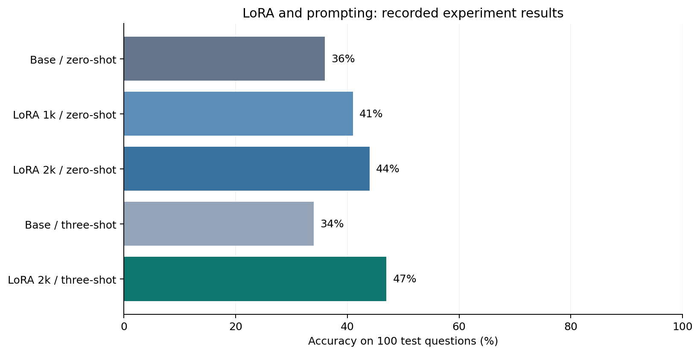

# Improving Math Reasoning with LoRA

Can lightweight fine-tuning help a small language model solve more math word problems?

I evaluated **Qwen2.5-1.5B-Instruct** on GSM8K, trained LoRA adapters, and compared zero-shot and
three-shot prompting. The best recorded setup answered **47 out of 100 questions correctly**,
compared with **36 out of 100** for the base model.

**[Read the notebook →](math_reasoning.ipynb)**



## What I learned

- The combined adapter and three-shot setup improved accuracy by **11 percentage points** on this sample.
- Gains were uneven: it corrected **26** baseline errors but introduced **15** new errors.
- Three-shot prompting alone did not help the base model here: **34%**, versus **36%** without examples.
- Correct formatting and fluent explanations did not guarantee correct reasoning.

The notebook shows an overtime calculation that improved and an egg-sales problem that regressed,
then explains the experimental limitations and how to run a fresh comparison.

## How to interpret the results

These are **historical notebook results**, checked against saved evaluations, not a fresh reproduction.
All five configurations used the same first 100 test questions. The 1k and 2k training runs also changed
rank, learning rate, and epochs, so their difference cannot be attributed to training size alone.
The best configuration combines fine-tuning and prompting changes. A later prompt sweep affected by
a Python escape bug is excluded. See [result provenance](results/README.md).

The optional rerun section uses a revised protocol with disjoint development, training, and demonstration
pools, fixed adapter settings, fresh prompts, and stricter scoring. Its results are saved separately.

## Run the notebook

Use Python 3.12 and clone the repository:

```bash
git clone https://github.com/comet-ctrl/open-source.git
cd open-source
python -m venv .venv
```

Activate with `.\.venv\Scripts\Activate.ps1` in Windows PowerShell, or `source .venv/bin/activate`
on macOS/Linux. To read and run the historical analysis without installing the model libraries:

```bash
python -m pip install matplotlib==3.10.6 jupyterlab
jupyter lab math_reasoning.ipynb
```

**Run All defaults to review mode:** it displays the chart and checks helper functions without downloading
a model or starting training. The optional experiment requires the full dependencies:

```bash
python -m pip install -r requirements.txt
```

For GPU use, first install the appropriate [PyTorch 2.8.0 CUDA build](https://pytorch.org/get-started/previous-versions/#v280).
Then enable `RUN_EXPERIMENTS` in the notebook. Full training needs suitable hardware; 4 GB VRAM is not
validated. CPU runs are supported but slow. The fresh full-model benchmark has not been rerun.

## What's included

- **One notebook:** method, chart, error analysis, and self-contained optional training/evaluation code.
- **One results table:** aggregate historical counts; no raw coursework exports.
- **Dependencies:** packages needed to run the full experiment.

The original experiments used educational helper code plus Hugging Face libraries. This portfolio
version uses newly written helpers and credits [Qwen](https://huggingface.co/Qwen/Qwen2.5-1.5B-Instruct),
[GSM8K](https://huggingface.co/datasets/openai/gsm8k), and [LoRA](https://arxiv.org/abs/2106.09685).
Original assignment documents, private links, submission IDs, and notebook outputs are excluded.
Generated artifacts stay under ignored `runs/`; clear notebook outputs and review metadata before sharing.
Deleting old files from this version does not erase existing Git history.
